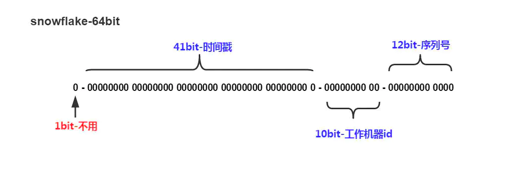

# Introduction to snowflake
```SnowFlake算法生成id的结果是一个64bit大小的整数，它的结构如下图```

- 1位是符号位，也就是最高位，始终是0，没有任何意义，因为要是唯一计算机二进制补码中就是负数，0才是正数。
- 41位是时间戳，具体到毫秒，41位的二进制可以使用69年，因为时间理论上永恒递增，所以根据这个排序是可以的。为了不浪费可用时间，算法中使用相对时间
进行计算，相对时间设置为了2022-01-01 00:00:00，即可以使用到2091-01-01 00:00:00。
- 10位工作机器ID，用来表示工作机器的ID，包括2位datacenterId和8位workerId，该服务将datacenterId固定为0，workerId可选范围为[0-255]
- 12位是计数序列号，也就是同一台机器上同一时间（毫秒），理论上还可以同时生成不同的ID，12位的序列号能够区分出4096个ID。

# Why snowflake-service
- 很多业务场景都有生成唯一ID的需求，为了避免重复开发本仓库提供了"拆箱即用"的雪花算法服务工程
- 雪花算法中比较重要的是如何在分布式集群中为每个雪花算法实例协调出唯一的工作机ID，该服务提供了两种机制来获取工作机ID，一种是SimpleProvider，
SimpleProvider需要使用者自行传入workerId。另一种是ConsulProvider，ConsulProvider通过consul session kv机制来自动获取唯一的workerId，
ConsulProvider也是默认设置。

# Usage
- snowflake-service目前只提供gGRP接口
- flags
    - host：服务监听的IP，默认为0.0.0.0
    - rpc-port：gRPC服务监听端口，默认为8080
    - metrics-port：http /metrics endpoint监听端口，默认为8090
    - provider：获取workerId的策略，可选值有[consul, simple]，默认为consul
    - enable-self-preservation：是否开启自我保护机制，可选值[true, false]，默认为true。开启自我保护机制以后consul provider获取不到worker id的时候会使用最后一次获取到的worker id，如果一次都没有获取成功则使用hint-worker-id
    - consul-address：consul provider需要连接的consul地址，默认为localhost:8500
    - consul-key-prefix:consul provider获取workerId时是通过consul session kv实现的，该值为consul key的前缀，默认为snowflake/worker/id/
    - hint-worker-id：consul provider会自动获取唯一的workerId，从hint-worker-id开始尝试，会将hint-worker-id ~ 255 ~ 0 ~ hint-worker-id
    都尝试获取一遍，直到获取成功位置。默认从0开始尝试获取。
    - worker-id：simple provider需要指定workerId，默认为0
- Go gRPC client example
```go
import (
	"context"
	pb "git.shiyou.kingsoft.com/sdk/snowflake-service/proto"
	"google.golang.org/grpc"
	"google.golang.org/grpc/credentials/insecure"
	"testing"
)

func TestSnowflake_NextId(t *testing.T) {
	c, _ := grpc.Dial("localhost:8080", grpc.WithTransportCredentials(insecure.NewCredentials()))
	client := pb.NewSnowflakeClient(c)
	id, err := client.NextId(context.Background(), &pb.NextIdRequest{})
	if err == nil {
		// use the id
		println(id.Id)
	}
}
```


# FAQ
- snowflake-service生成的ID是多少位的数字：雪花算法生成的ID位数并不固定，随着时间的推移ID的增长位数也会随之增长，目前是17位（2022-05-08）
- snowflake-service生成的ID是连续的吗：不是，snowflake-service生成的ID是非连续、根据时间单调递增的。
- 如果时钟回拨了snowflake-service是怎样处理的：目前snowflake-service并没有处理时钟回拨的问题，后续版本会考虑增强这方面的能力。
- snowflake-service的并发能力怎么样：单个snowflake-service进程处理NextId()请求时是加互斥锁处理了，也就是串行处理，使用者可以根据自己业务量的情况来增加snowflake-service实例数来提高并发能力， 后续版本会针对并发能力进行改进。参考压测结果如下：
  ```shell
  ./ghz --insecure --proto ./snowflake.proto --call seayoo.snowflake.Snowflake/NextId  localhost:8080 -n 10000 -c 10
  Summary:
  Count:        10000
  Total:        931.14 ms
  Slowest:      3.81 ms
  Fastest:      0.11 ms
  Average:      0.60 ms
  Requests/sec: 10739.53

  Response time histogram:
  0.114 [1]    |
  0.483 [3669] |∎∎∎∎∎∎∎∎∎∎∎∎∎∎∎∎∎∎∎∎∎∎∎∎∎∎∎∎∎∎
  0.853 [4901] |∎∎∎∎∎∎∎∎∎∎∎∎∎∎∎∎∎∎∎∎∎∎∎∎∎∎∎∎∎∎∎∎∎∎∎∎∎∎∎∎
  1.223 [1084] |∎∎∎∎∎∎∎∎∎
  1.592 [232]  |∎∎
  1.962 [67]   |∎
  2.331 [19]   |
  2.701 [9]    |
  3.071 [5]    |
  3.440 [7]    |
  3.810 [6]    |
  
  Latency distribution:
  10 % in 0.31 ms
  25 % in 0.42 ms
  50 % in 0.55 ms
  75 % in 0.72 ms
  90 % in 0.95 ms
  95 % in 1.13 ms
  99 % in 1.64 ms
  
  Status code distribution:
  [OK]   10000 responses
  ```
# Reference
- [Consul Session](https://www.consul.io/docs/dynamic-app-config/sessions)
- [Consul KV](https://www.consul.io/docs/dynamic-app-config/kv)
- [Application Leader Election with Consul Sessions](https://learn.hashicorp.com/tutorials/consul/application-leader-elections)
